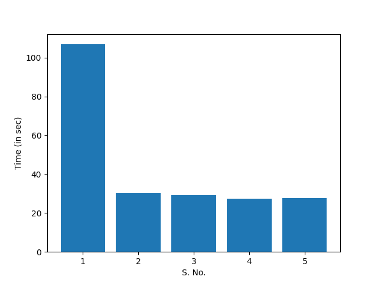

# OMP Parallelization of LJMD code

by Avinash Anand, repository: <https://github.com/anand-avinash/ljmd>

To run the code with `OpenMP` parallelization, create the executables with `./cmake.sh omp`.

Starting from the serial code, I added the naive `OMP` parallelization by distributing the outermost loop to different threads in `verlet_1()`, `verlet_2()`, and `ekin()` functions. I added the `OMP` parallelization for the force calculation in two different ways, using:

1. **Naive implementation**  
In this implementation, I used `OMP` parallelization on top level loop and used `OMP` reduction to calculate the potential energy. I tested dynamic and static scheduling with different chunksizes. The time taken by them using 4 threads and 2910 particles with 1000 iterations is tabulated below:

| Scheduling | Chunksize | Time taken (in sec) |
| :---: | :---: | :---: |
| default | default | 29.214 |
| dynamic | default | 30.839 |
| dynamic | 32 | 29.446 |
| dynamic | 128 | 30.100 |
| static | default | 29.885 |
| static | 32 | 30.979 |
| static | 128 | 32.152 |

As can be observed from the results, naive `OMP` implementation with default scheduling has better performance than others.

1. **Newton's third law**  
In this version, I implemented Newton's third law to iterate over a pair of particle only once for force and energy calculation. To avoid the race condition, I used `omp critical` pragma.

Our approach using Newton's third law was slightly better than the naive `OMP` implementation, so we proceeded with that in subsequent versions.

The subsequent version include serial optimization and vector packing. In the serial optimization, expensive mathematical functions like `pow()` and `sqrt()` was avoided, and redundant calculations was reduced. In the vector packing implementation, we packed the coordinates of a particle in a single `struct` allowing better cache efficiency.

The final version of the code on my repository includes serial optimization, vector packing, MPI and OpenMP parallelization.

I measured the time taken by the code in for different implementations on my system. In all cases, I used four threads for `OMP` and did the simulation with 2916 particles with 1000 iteration. The measured time is tabulated below.

| S. No. | Implementation | Time taken (in sec) |
| :---: | :--- | :---: |
| 1 | Serial | 106.823 |
| 2 | `OMP` naive | 30.559 |
| 3 | `OMP` with Newton's 3rd law | 29.094 |
| 4 | `OMP` with Newton's 3rd law and serial opt. | 27.455 |
| 5 | `OMP` with Newton's 3rd law, serial opt. & vector packing | 27.634 |

A plot corresponding the table above is shown below:  
